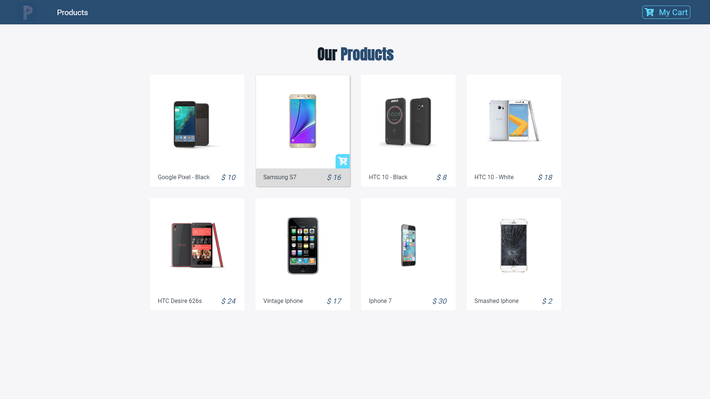
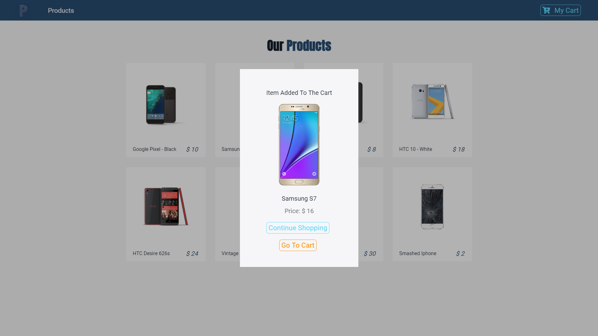
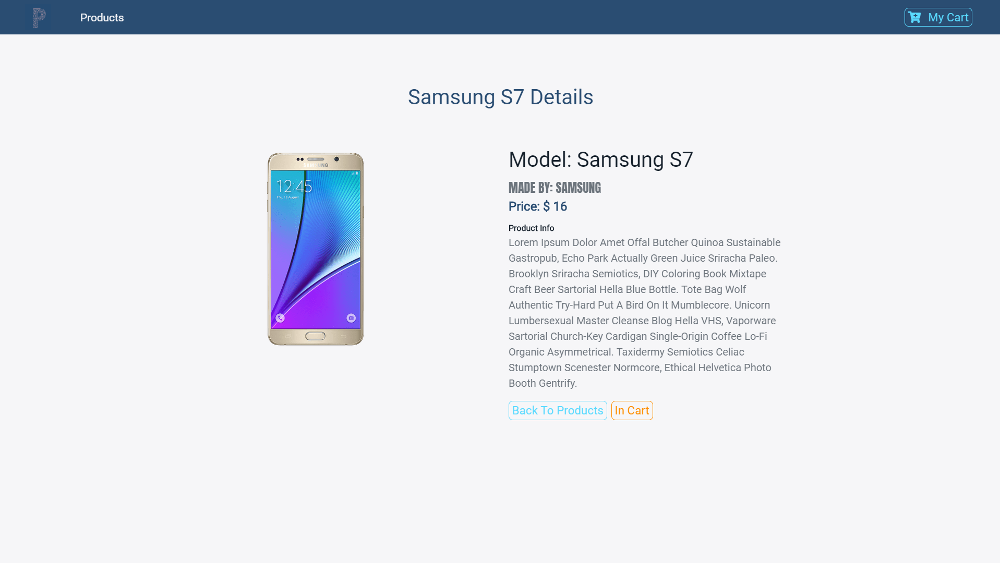
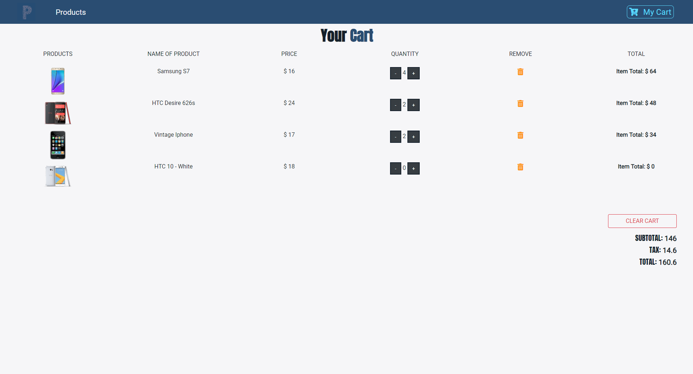
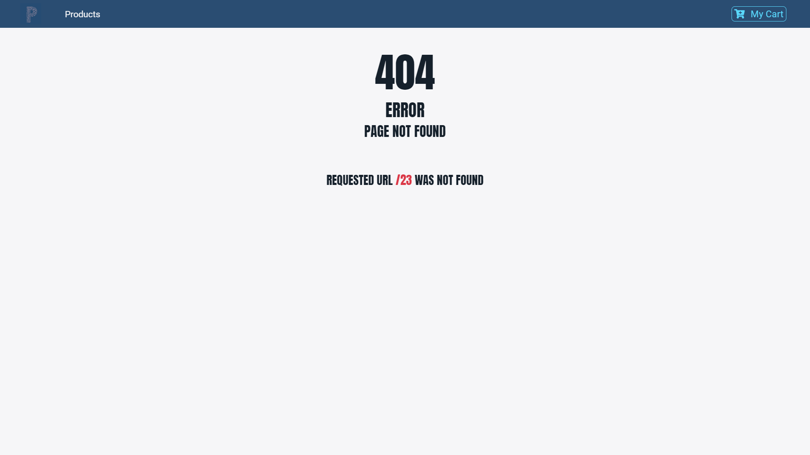

# My 5th React Project. E-commerce site

> Based on React Tutorial: Build an e-commerce site from scratch using React and Netlify from https://www.youtube.com/watch?v=wPQ1-33teR4&list=WL&index=201&t=0s

## You can
* Add Item to the cart
* View Details of the item
* Navigate to shopping cart
* Manipulate items in a shopping cart
* Navigate to non-existing page (404 error handler)

## Features
* Uses Context API
* Uses Bootstrap
* Uses Styled Components
* Uses FontAwesome
* Uses Google Fonts

## Screenshots

### Main

### Modal

### Details

### Cart

### 404

Live Demo https://practical-noether-d4ae2f.netlify.com/
